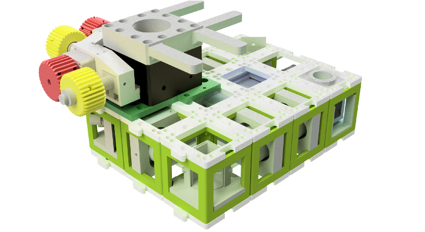

# openUC2 *Lightsheet Microscope*
---

We will start setting up the documentation to rebuild the UC2-based lightsheet microscope that features a single mode fiber, a low-cost monochromatic camera and an accurate, yet low-cost XYZ stage mechanism.

The final result may look like this:

It is inspired by the design of the [openspim](openspim.org).

## Reults

*3D printed Phantom (Nanoscribe)*

*3D Rendering of printed Phantom (Nanoscribe)*

<a href="#logo" name="logo">

*3D rendering of Daphnia ("Flusskrebs")*

<a href="#logo" name="logo">

<a href="#logo" name="logo">

*Stack of a Zebrafish*

<a href="#logo" name="logo">

<a href="#logo" name="logo">

***Features:***
* IT MOVES?!
* IT TAKES IMAGES?!
* IT DOES YOUR LAUNDRY?!

## In-Action
*SHARE YOUR FANCY GIF HERE. IT MOVES!*

# Software
*HOW DO I CONTROL THIS THING?*

## Custom Python code *IF APPLICABLE*
We also provide a code example for driving the device using a python driver. Please refer to the code and the package in the folder [PYTHON](./PYTHON).

## *CUSTOM FANCY SOFTWARE*
We also provide *SOME SORCERY* for driving the device. Find the files in folder [*MY_AWESOME_SOFTWARE*]().

# Hardware

Below we describe how the device can be build and assembled in order to replicate the whole system as shown in the rendering above. One needs additional parts that can be found in the core [openUC2 repository](https://github.com/bionanoimaging/UC2-GIT).

## Bill of material

Below you will find all components necessary to build this device

### 3D printing files

All these files need to be printed. We used a Prusa i3 MK3 using PLA Prusament (Galaxy Black) at layer height x.x mm and infill xx%.

|  Type | Details  |  Price | Link  |
|---|---|---|---|
| *FANCY* Holder |  *IT HOLD OTHER FANCY PARTS* |  x,xx € | [Part.stl](./STL/)  |

### Additional parts
This is used in the current version of the setup

|  Type | Details  |  Price | Link  |
|---|---|---|---|
| *FANCY* Part | *IT DOES SOME MAGIC* |  xx € | [My favourite online shop]()  |

### Design files
The original design files are in the [INVENTOR](./INVENTOR) folder. *FOR ANOTHER FORMAT, GET YOUR OWN FOLDER.*

### Electronics
*THE FANCY ELECTRONICS TO RUN THE MOTOR! ...OR WHATEVER YOU USE THERE.*

### Assembly of the DEVICE

***1.*** *These are the parts needed for the DEVICE*

***2.*** *Start by ...*

***2.*** *Continue with ...*

***2.*** *DONE! LOOK AT THE BEAUTY!*

## Showcase
*AWESOME RESULTS!*

***Fig 1.*** *MY MOST AWSOME IMAGE*

# Resouces Galvo

Some links

Open-Source board using the ESP32
https://oshwlab.com/chris_9044/laser-show-driver-breadboard

Code for ESP32 + Galvo
https://github.com/atomic14/esp32-laser-show

How do Galvos look from the inside?
https://www.youtube.com/watch?v=HIBH55cbfLM

## Get Involved

This project is open so that anyone can get involved. You don't even have to learn CAD designing or programming. Find ways you can contribute in  [CONTRIBUTING](https://github.com/openUC2/UC2-GIT/blob/master/CONTRIBUTING.md)

## License and Collaboration

This project is open-source and is released under the CERN open hardware license. Our aim is to make the kits commercially available.
We encourage everyone who is using our Toolbox to share their results and ideas, so that the Toolbox keeps improving. It should serve as a easy-to-use and easy-to-access general purpose building block solution for the area of STEAM education. All the design files are generally for free, but we would like to hear from you how is it going.

You're free to fork the project and enhance it. If you have any suggestions to improve it or add any additional functions make a pull-request or file an issue.

Please find the type of licenses [here](https://github.com/openUC2/UC2-GIT/blob/master/License.md)

REMARK: All files have been designed using Autodesk Inventor 2019 (EDUCATION)

## Collaborating
If you find this project useful, please like this repository, follow us on Twitter and cite the webpage! :-)
